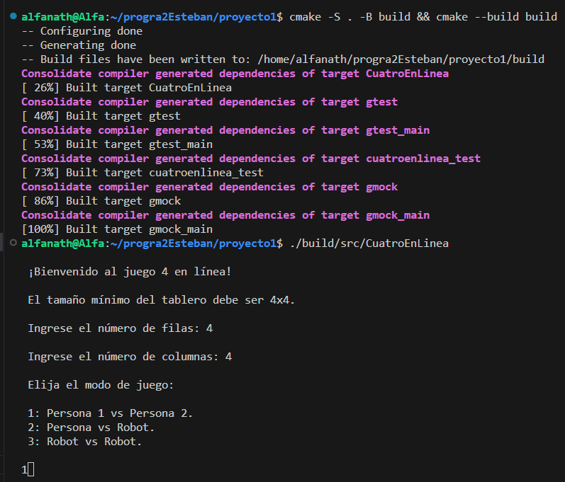
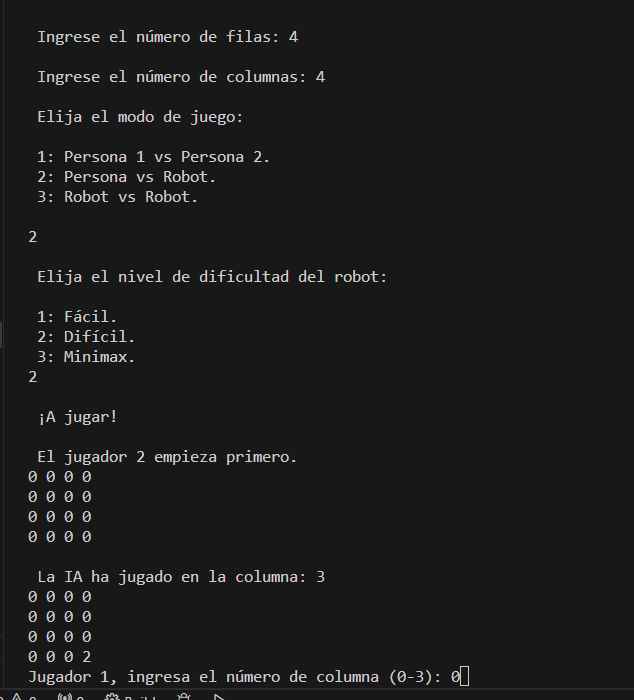
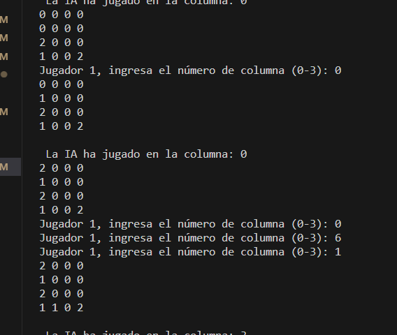
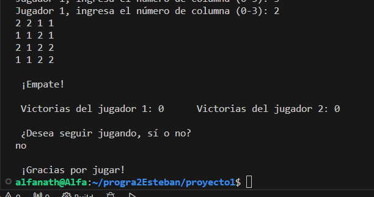
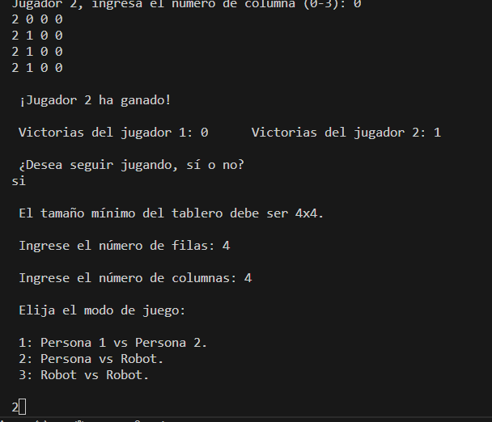

Nota: El code no corre porque está comentado ya que no dejaba compilar la interfaz gráfica, cuando hice clang format a la carpeta de src, dejó de compilar, pero si funcionara, debería salirle 2 ventanas.


# Conecta 4 en línea


Este clásico videojuego consta de un tablero mínimo de 4 filas y 4 columnas, ya que para poder ganar debe tener 4 fichas del mismo color seguidas de forma vertical, horizontal o diagonal, y sus inversas.


Esta versión tiene 3 modos de juego: Persona 1 vs Persona 2, Persona vs Robot y Robot 1 vs Robot 2. Los robots tienen una opción extra de colocarle dificultad ya sea fácil o difícil.


### Requerimentos:

Este template busca la biblioteca wxWidgets usando `FindPackage`. Si no lo encuentra, descarga el código fuente de la biblioteca de GitHub, lo compila y lo vincula con el proyecto principal. El patrón de supercompilación con `ExternalProject_Add` se utiliza para lograr esto.


Esto funciona en Windows, Mac y Linux. Necesitará `cmake` y un compilador de C++ (probado en `clang`, `gcc` y MSVC).


Las compilaciones de Linux requieren la biblioteca GTK3 y los encabezados instalados en el sistema.


Utilice el script `copy_to_project.sh` proporcionado para crear otro proyecto a partir de la plantilla.

```bash
./copy_to_project.sh directory project_name
``` 

Esto creará una copia de la estructura del directorio de la plantilla en `directory`, cambiando el nombre de `wx_cmake_template` al `project_name` proporcionado.


### Para compilar el programa:

El primer comando genera un proyecto de Make y el segundo lo construye:

` cmake -S . -B build && cmake --build build `


### Para ejecutar el programa:

` ./build/subprojects/Build/wx_cmake_template_core/main `


### Para ejecutar las pruebas:

```
cd build/tests 
ctest

cd build/tests
./cuatroenlinea_test

./build/tests/cuatroenlinea_test 
```


### Verificar las fugas de memoria:

```
valgrind --leak-check=full --show-leak-kinds=all ./build/tests/cuatroenlinea_test 

valgrind --leak-check=full --show-leak-kinds=all ./build/src/CuatroEnLinea 
```


### Para formatear con Clang format:

```
clang-format -i main.cpp

clang-format -i include/* src/*

clang-format -style=google -i include/* src/*
```


### Forma de utilizar el programa:

Primeramente, hay que abrir Terminal y luego Nueva terminal, compilar y ejecutar el programa con los comandos antes mencionados y así la consola imprimirá un mensaje de "¡Bienvenido al juego 4 en línea!", indicando que ya está jugando, posteriormente le pregunta el tamaño de las filas y las columnas para crear el tablero, pero estas deben ser mayor o igual a 4.

También solicitará el modo de juego que hay 3 modos: (1) Persona 1 vs Persona 2, (2) Persona vs Robot y (3) Robot 1 vs Robot 2. Si elije alguna opción con un robot se le consultará la dificultad de este ya sea (1) Fácil o (2) Difícil.

Entre los dos jugadores se eligirá uno aleatoriamente para que coloque la ficha de primero, se le irá preguntando en su turno correspondiente en cuál columna desea digitar su ficha, mientras dicha celda esté disponible, todo esto para el caso de cuando es una persona jugando ya que el robot coloca su ficha automáticamente.

Al final de la partida, se indicará quién ganó y se le sumará un punto, mostrando el marcador. Además, se pregunta si desea volver a jugar o no, en caso de "sí", se vuelve a preguntar el tamaño del tablero, el modo y demás. En caso de que no quiera volver a jugar, digita "no" y el programa termina con un mensaje "¡Gracias por jugar!".


### Proceso:

Proceso de compilación, ejecución e inicio del juego. Solicita el tamaño del tablero y el modo de juego:



Si elige la opción con un robot, le solicita el nivel de dificultad y empieza el juego con un mensaje de inicio, además indica cuál jugador inicia primero de manera aleatoria. Se muestra una persona jugando con un robot:



Este ejemplo muestra a dos personas jugando mientras una de ellas se equivoca en colocar la columna y el programa se la vuelve a solicitar. También, al final se observa cuál jugador ganó y cuánto es su puntaje y se pregunta si desea volver a jugar, la respuesta "no" llevaría a que se termine el programa y este se despide agradeciendo:





Este imagen presenta donde inicialmente había una partida que llega a su fin y se le pregunta si desea volver a jugar y se responde "si" y vuelve a iniciar el programa, cabe destacar que el marcador no se reinicia:




### Funcionalidad implementada:

Se implementa el videojuego con los requisitos solicitados por el docente como:

- Es posible configurar el tamaño del tablero, mínimo de 4 filas y 4 columnas.
- Es posible indicar el modo de juego: (1) Persona 1 vs Persona 2, (2) Persona vs Robot y (3) Robot 1 vs Robot 2.
- El nivel “inteligente” es mejor que el nivel “malo”. El cual se le pregunta al usuario cuando elije un modo con un robot, (1) Fácil o (2) Difícil.
- El juego se dibuja correctamente en la terminal.
- Al finalizar la partida, se pregunta si desea volver a jugar.
- Se indica el ganador y el marcador actual.
- El código está bien estructurado en clases con POO, nombres significativos y código formateado con clang-format.
- Buena cobertura de la programación defensiva.
- No hay fugas de memoria al ejecutar con Valgrind, al igual para las pruebas automatizadas.
- Dos ventanas de Wxwidgets.
- Code Coverage.


### No se implementó:

- Minimax.
- QuickCheck.
- El informe de coverage de las pruebas unitarias, pero se agrega el Code Coverage.
- El uso frugal de la memoria no se implementa ya que no se crea "new".
- Programación defensiva ante errores, pero falta para la entrada de cuando el usuario digita el número de columna para colocar su ficha.
- Abarcar pruebas automatizadas para los métodos sin argumentos.
- Completar la interfaz gráfica.


### Notas:

For details, see the [blog post](https://www.justdevtutorials.com/post/wxwidgets-cmake/) and the [video](https://www.youtube.com/watch?v=MfuBS9n5_aY) tutorial showcasing the installation on Linux, Windows, and Mac OS X. 

---
Check out the blog for more! [www.justdevtutorials.com](https://www.justdevtutorials.com)
---


#### Créditos:

- Nathalie Alfaro Quesada, B90221.


